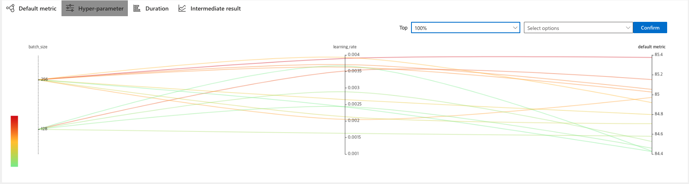

# BLSTM CRF with Tensorflow 2 (+NNI)

Tensorflow2와 NNI를 활용한 개체명 인식기 학습 코드

NNI는 효과적인 hyper parameter 튜닝 도구로서 자세한 사항은 다음 링크를 참고 바랍니다.
https://github.com/microsoft/nni 

## Requirements envirenment
이 코드는 python 3.6 기반으로 작성되었습니다.
 
    tensorflow == 2.2.0
    tensorflow_addons == 0.10.0
    devtools == 0.5.1
    pydantic == 1.4
    ruamel.yaml == 0.16.10
    tqdm == 4.43.0
    
    #optional
    tensorflow_hub == 0.8.0 #optional
    nni == 1.6
    smac == 0.8.0

## DataSet
데이터는 다음처럼 기본적인 conll 2003 format을 사용하지만 token, pos, label 정보만 사용합니다.
데이터 파일을 파싱할때 [0], [1], [-1] 3가지 위치의 정보만 사용하므로,
해당 포맷에 맞지 않는 경우 'feature_extractor.py'파일을 수정해서 사용해야 합니다. 

    EU NNP I-NP I-ORG
    rejects VBZ I-VP O
    German JJ I-NP I-MISC
    call NN I-NP O
    to TO I-VP O
    boycott VB I-VP O
    British JJ I-NP I-MISC
    lamb NN I-NP O
    . . O O
	
## Model
* 장비 한계로 다양한 실험을 해보기 위해 BERT(=Transformer)류의 모델을 선택 하지 않고
비교적 가벼운 모델은 선택했습니다.
* 실제로 다음 리더보드를 보면 bert류의 모델과 그보다 훨씬 가벼운 형태의 모델들의 f1 score가 크게 차이나지 않음을 볼 수 있습니다. 
* https://paperswithcode.com/sota/named-entity-recognition-ner-on-conll-2003

### Baseline BiLSTM-의CRF(chars embeddings using CNN)
* https://arxiv.org/pdf/1603.01354.pdf

### Baseline BiLSTM-의CRF(chars embeddings using LSTM)
* baseline 모델에서 char representation layer 부분만 lstm으로 변경했습니다.

### BiLSTM-CRF + ELMO(chars embeddings using BiLSTM)
* https://arxiv.org/pdf/1802.05365.pdf
* baseline 모델의 token embedding layer를 elmo로 대체
* tf hub에서 제공하는 pretrained elmo 사용하여 전체 layer를 trainable 하게 학습하려고 했으나,
해당 hub 모듈이 tf2를 지원하지 않아서 elmo layer의 weight를 고정해놓고 학습을 진행했습니다.
https://tfhub.dev/google/elmo/3 
* TODO: trainable elmo - custom elmo layer를 구현해서 https://allennlp.org/elmo 에서 제공하는 pretrained elmo weight import 해서 사용하도록 구현 예정 

### 평가 방법
* 평가 공정성을 위해 conll 2003 공식 평가 도구를 사용했습니다.
* 공식 코드는 perl로 작성 되어 있지만 다음 코드를 사용해서 python에서 direct로 호출해서 사용했습니다.
* https://github.com/sighsmile/conlleval/blob/master/conlleval.py
* metric은 micro average f1 score를 사용하며, class별로 분리 하지 않고 전체 토큰을 합산해서 recall, precision, f1score를 계산하는 방식입니다.
    * Micro-average of precision: (TP1 + TP2 + ... TPN) / (TP1 + TP2 + ... TPN + FP1 + FP2 + ... FPN) 
    * Micro-average of recall: (TP1 + TP2 + ... TPN) / (TP1 + TP2 + ... TPN + FN1 + FN2 + ... FNN)
    * F1 Score = 2*(Recall * Precision) / (Recall + Precision)

## Getting started
    wget http://nlp.stanford.edu/data/glove.6B.zip --directory-prefix=pretrained/glove.6B

### 학습 데이터 준비
validation 데이터가 없으면 train 데이터를 8:2로 train:valid(dev)로 분리하도록 되어있으며 파라메터를 통해서 조정가능합니다.

	python prepare.py --train_paths data/conll2003/train.txt --valid_paths data/conll2003/valid.txt --test_paths data/conll2003/test.txt --separator whitespace --output_dir data/conll2003
	
	python prepare.py --train_paths data/ner/train.tsv --test_paths data/ner/test.tsv --separator tab --output_dir data/ner
	
실행 화면

    file: 100%|███████████████████████████████████████| 1/1 [00:03<00:00,  3.73s/it]
    total examples: 14988
    label num: 11
    pos num: 48
    max token length: 113
    avg token length: 13.648652255137444
    max char length: 61
    avg char length: 4.397074782710714
    file: 100%|███████████████████████████████████████| 1/1 [00:01<00:00,  1.09s/it]
    total examples: 3467
    label num: 11
    pos num: 48
    max token length: 109
    avg token length: 14.876550331698875
    max char length: 27
    avg char length: 4.388525893324544
    file: 100%|███████████████████████████████████████| 1/1 [00:00<00:00,  1.08it/s]
    total examples: 3685
    label num: 11
    pos num: 48
    max token length: 124
    avg token length: 12.663500678426052
    max char length: 37
    avg char length: 4.3375549126754525
	
### 학습
학습 파라메터는 yaml로 작성된 파일을 입력받도록 되어있으며, conf에 기본적인 실행 옵션들을 제공하고 있습니다.

	python train.py baseline.yaml
	
	python train.py baseline_conll2003.yaml
	
	python train.py tunned.yaml
	
	python train.py tunned_conll2003.yaml

실행 화면

    train.py:79 main
        train_param: TrainParam(
            train_paths=[
                'data/conll2003/train.pkl',
            ],
            valid_paths=[
                'data/conll2003/valid.pkl',
            ],
            test_paths=[
                'data/conll2003/test.pkl',
            ],
            vocab_path='data/conll2003/vocab.pkl',
            output_dir='trained/conll2003',
            overwrite=True,
            pretrained_embedding_path='pretrained/glove.6B/glove.6B.100d.txt',
            do_lowercase=True,
            rand_seed=777,
            batch_size=32,
            optimizer='adam',
            learning_rate=0.004,
            lr_decay_rate=1e-05,
            optimizer_param={},
            epochs=100,
            early_stop_patience=10,
            train_steps=100,
            use_elmo=False,
            elmo_output='elmo',
            emb_dim=100,
            char_emb_dim=30,
            pos_emb_dim=30,
            max_word=100,
            max_char=15,
            token_dropout=0.5,
            pos_dropout=0.5,
            char_dropout=0.5,
            lstm_units=200,
            lstm_recurrent_dropout=0.0,
            lstm_dropout=0.5,
            lstm_layer_size=1,
            char_lstm_units=50,
            char_lstm_recurrent_dropout=0.0,
            char_lstm_dropout=0.5,
        ) (TrainParam)
    wv vector oov rate: 0.12364363221016562
    INFO:ner:epoch 1, loss: 36.983177185058594, 13.870611999999994/step
    INFO:ner:epoch 1, loss: 11.903252601623535, 2.5075678181818177/step
    INFO:ner:epoch 1, loss: 9.45557975769043, 1.4202159523809523/step
    INFO:ner:epoch 1, loss: 8.061817169189453, 1.035465451612903/step
    INFO:ner:epoch 1, loss: 7.0914435386657715, 1.0299985365853657/step
    INFO:ner:epoch 1, loss: 6.360032558441162, 0.8898626862745097/step
    INFO:ner:epoch 1, loss: 5.847697734832764, 0.7952445409836064/step
    INFO:ner:epoch 1, loss: 5.478971004486084, 0.7260927323943662/step
    INFO:ner:epoch 1, loss: 5.189591884613037, 0.6764184320987654/step
    INFO:ner:epoch 1, loss: 4.915287017822266, 0.6400012637362636/step
    INFO:ner:epoch 1, loss: 4.678853511810303, valid f1-score: 76.12197928653625, test f1-score: 76.37579811492854

## Experiment
* 본 실험은 NNI기반으로 진행 되었습니다.
* baseline은 다음 논문의 파라메터를 차용했으며 (Xuezhe Ma and Eduard H. Hovy. 2016. End-to-end
sequence labeling) 이후 실험은 실험자의 직관에 의한 학습 파라메터 range를 설정하고 nni를 통해서 파라메터 튜닝을 진행했습니다.

### Baseline
baseline 결과는 다음과 같습니다.

    validation 84.2
    test 84.45

### Experiment1
설정할수 있는 거의 모든형태의 파라메터를 실험자의 경험과 여러 paper의 수치를 기반으로 러프하게 range를 설정했습니다.

전체 학습에 많은 시간이 소요되기 때문에 실험 추이를 보면서 실험자에 직관에 따라서
실험 결과에 영향이 적은 파라메터를 fixed 시키고 다음 실험으로 넘어가는 과정이 필요합니다. 

    nnictl create --config nni/config-1.yaml

search space

    {
        "batch_size":  { "_type": "choice", "_value": [16, 32] },
        "token_dropout": { "_type": "uniform", "_value": [0.1, 0.5] },
        "pos_dropout": { "_type": "uniform", "_value": [0.0, 0.5] },
        "char_dropout": { "_type": "uniform", "_value": [0.0, 0.5] },
        "char_emb_dim": { "_type": "quniform", "_value": [30, 50, 10] },
        "pos_emb_dim": { "_type": "quniform", "_value": [30, 50, 10] },
        "learning_rate": { "_type": "uniform", "_value": [0.001, 0.01] },
        "lr_decay_rate": { "_type": "uniform", "_value": [0.000001, 0.0001] },
        "char_cnn_window_size": {"_type": "quniform", "_value": [2, 4, 1]},
        "char_cnn_filter_num": { "_type": "quniform", "_value": [20, 40, 10]},
        "lstm_layer_size": { "_type": "quniform", "_value": [1, 2, 1] },
        "lstm_units": { "_type": "quniform", "_value": [200, 500, 100] },
        "lstm_recurrent_dropout": { "_type": "uniform", "_value": [0.1, 0.5] },
        "lstm_dropout": { "_type": "uniform", "_value": [0.1, 0.5] }
    }

실험을 통해서 결정된 수치는 다음과 같습니다.

    batchsize: 32
    token_dropout: 0.45
    pos_dropout: 0.025
    char_dropout: 0.06
    char_emb_dim: 50
    pos_emb_dim: 50    
    learning_rate: 7e-3
    lr_decay_rate: 6e-5
    char_cnn_window_size: 2 ~ 4
    char_cnn_filter_num: 20 ~ 40
    lstm_layer_size: 1
    lstm_units: 200 ~ 400
    lstm_recurrent_dropout: 0.25
    lstm_dropout: 0.2

실험을 통해 찾은 best 결과는 다음과 같습니다.    

    validation 85.12
    test 85.59
    
### Experiment2
앞선 실험에서 범위를 좁히거나 fixed 파라메터를 기준으로 다시 nni를 구동합니다.

    nnictl create --config nni/config-2.yaml
    
search space

    {
        "char_cnn_window_size": {"_type": "quniform", "_value": [2, 4, 1]},
        "char_cnn_filter_num": { "_type": "quniform", "_value": [20, 40, 10]},
        "lstm_units": { "_type": "quniform", "_value": [200, 400, 100] }
    }
    

실험을 통해서 결정된 수치는 다음과 같습니다.

    char_cnn_window_size: 3
    char_cnn_filter_num: 40
    lstm_units: 3000
    
실험을 통해 찾은 best 결과는 다음과 같습니다.    

    validation 85.21
    test 85.62
        
    

 

### Experiment3
이번에는 batch size를 늘리고 learning rate를 줄여서 학습을 안정적으로 가져가보도록 했습니다.

    nnictl create --config nni/config-3.yaml
    
search space
    
    {
        "batch_size":  { "_type": "choice", "_value": [128, 256] },
        "learning_rate": { "_type": "uniform", "_value": [0.001, 0.004] }
    }

실험을 통해서 결정된 수치는 다음과 같습니다.

    lstm_layer_size: 128
    lstm_units: 50

### Experiment4
character representation layer를 cnn대신 lstm을 사용했습니다. 이번에는 시간관계상 nni를 사용하지 않았습니다.

    

### Experiment5
token embedding을 glove word vector 대신 elmo를 사용했습니다.

        
    
## Evaluation
* 원 모델이 conll 2003 데이터 기준 91.21에 보였지만 구현한 코드는 그에 못미치는 수치를 보여주고 있다.
하지만 원 모델은 token, pos, chuk 입력을 활용한데 반해 이 모델은 token, pos정보만을 사용한것을 감안하면 이해가능한 수치라고 보인다.
* char representation은 cnn/lstm 어떤것을 사용하더라도 성능에 큰 차이가 없음을 확인했다.
그러나 이왕이면 계산속도가 더 빠른 cnn을 사용하는것이 좋아 보인다.
* 마지막 elmo를 사용하는 편이 더 낮은 성능을 보이고 있는데 elmo layer를 fixed상태로 학습한것이 큰 영향을 줬을것이라고 생각되고
trainable하게 수정하면 더 높은 수치가 나올것이라고 생각 된다.

|                                         | **conll2003** | **ner**  |
|-----------------------------------------|---------------|----------|
| **blstm+charcnn+crf(paper)**            | 91.21         |  -       |
| **blstm+charcnn+crf(baseline-our impl)**| 89.15         | 84.45    |
| **blstm+charcnn+crf(experiment1)**      | 89.44         | 85.59    |
| **blstm+charcnn+crf(experiment2)**      | 89.02         | 85.62    |
| **blstm+charcnn+crf(experiment3)**      | 90.07         | **86.01**|
| **blstm+charlstm+crf**                  | **90.23**     | 85.69    |
| **blstm+charcnn+crf+elmo**              | 88.94         | 84.28    |

## TODO
* BERT(Transformer) 적용
* Trainable ELMO 적용
* BERT MRC(+Nested NER) 검토

## Reference
* https://arxiv.org/pdf/1603.01354.pdf
* https://arxiv.org/pdf/1802.05365.pdf
* https://paperswithcode.com/sota/named-entity-recognition-ner-on-conll-2003
* https://tfhub.dev/google/elmo/3
* https://github.com/sighsmile/conlleval/
